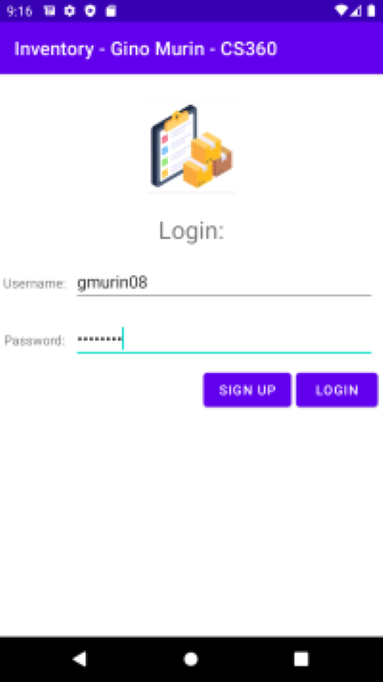
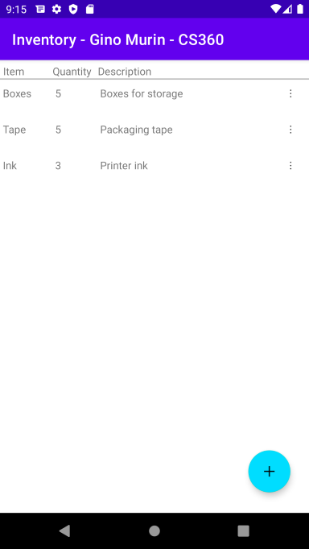
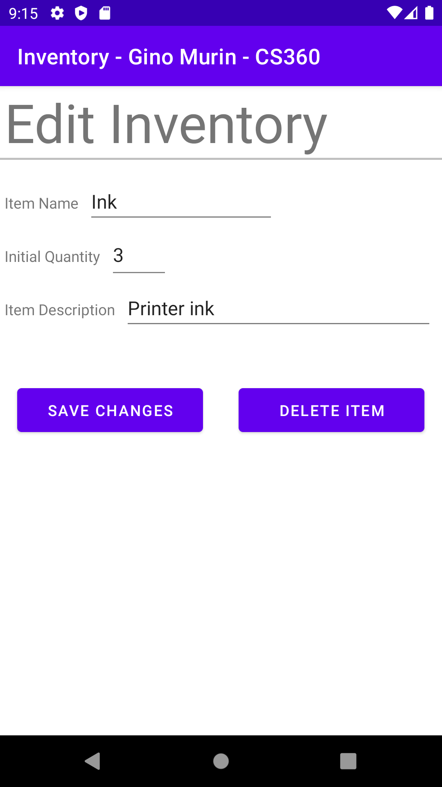
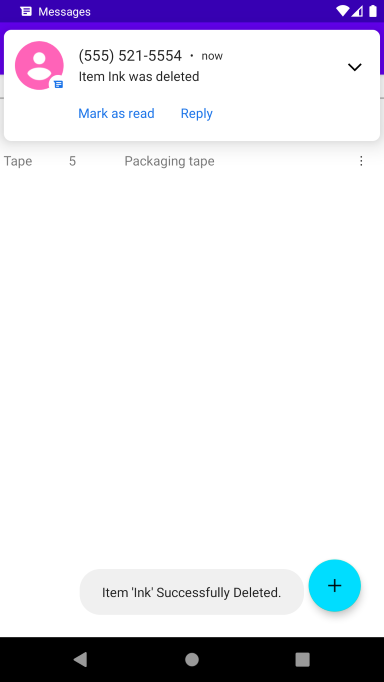

# Android Inventory App
An MVC based Android app built in Java using Android Studio. Applicaton features a database complete with user authentication, live inventory update functionality, as well as
an SMS notification API that messages the user when inventory stock is deleted or reaches an alert threshold

